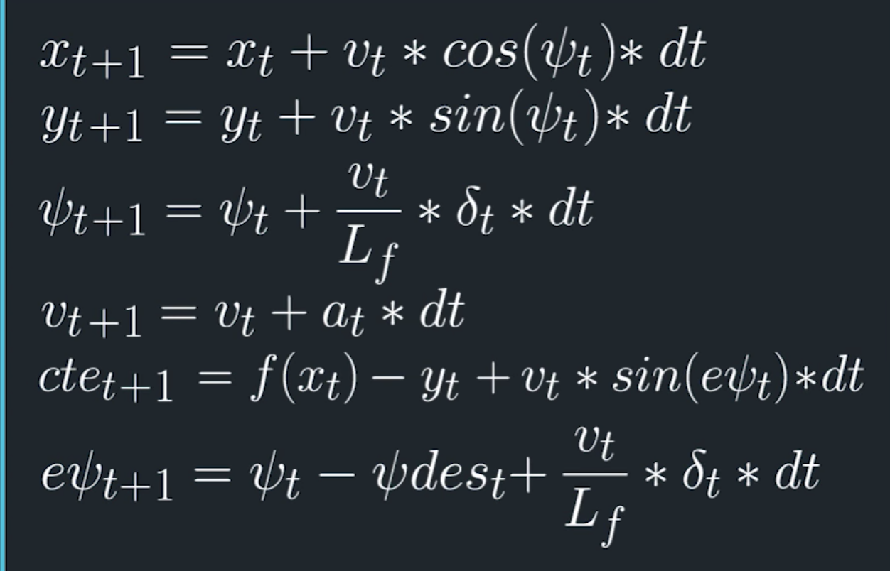

# Reflection

### The Model

The model I used is the kinematic model. The state contains the car's x and y coordinates, orientation angle, velocity, cross track error, and orientation error. The actuators are acceleration and steering angle. The update equations use the state and actuators to calculate the state of the future time step. The equations are the following:

### Timestep Length and Elapsed Duration (N & dt)

The timestep length (N) and the elapsed duration (dt) I used is 20 and 0.1. The car can run quite fast. 10 / 0.1 is also okay and it behaves similarly to 20 / 0.1, but 20 / 0.1 seems more stable. 10 / 0.2 seems also okay, even though the car becomes more conservative in terms of driving speed (it brakes a lot when curving).

### Polynomial Fitting and MPC Preprocessing

The server gives me the state in global coordinate system, so I transformed them to car coordinate system. Then those are used for polynomial fitting.

### Model Predictive Control with Latency

To handle latency, the state is calculated using the model and the delay interval. Then those are used for MPC.
